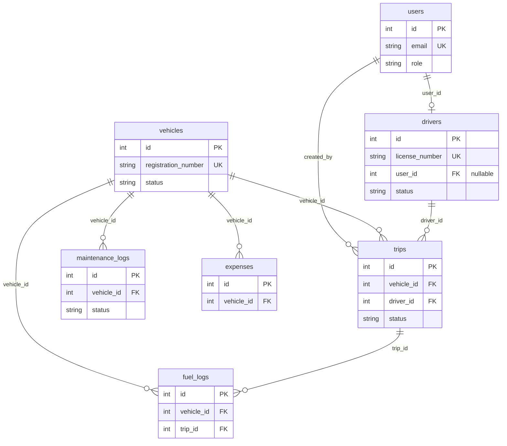

# TransitOps

**Smart Transport Operations Platform**

Fleet operations in one place — vehicles, drivers, dispatch, maintenance, fuel/expenses, and live KPIs — with hard business rules enforced in the API.

PostgreSQL · FastAPI · React · Docker Compose

---

## Features

1. **Secure login + RBAC** — Fleet Manager, Driver, Safety Officer, Financial Analyst  
2. **Dashboard** — Fleet KPIs plus filters by vehicle type, status, and region  
3. **Vehicle registry** — Unique plates, load capacity, odometer, status lifecycle  
4. **Driver management** — Licenses, expiry checks, safety scores  
5. **Trip dispatch** — Draft → Dispatched → Completed / Cancelled; create form uses dispatch pool + Available drivers  
6. **Maintenance** — Open a job → vehicle goes **In Shop** (hidden from dispatch)  
7. **Fuel & expenses** — Cost logging and per-vehicle operational totals  
8. **Analytics** — Fuel efficiency (km/L), vehicle ROI, cost views + CSV export  

### Rules the API enforces

No double-booking · cargo ≤ max load · expired/suspended licenses blocked · In Shop / Retired excluded from dispatch · status transitions on dispatch, complete, cancel, and maintenance

---

## Run locally (one command)

**Requirement:** [Docker Desktop](https://www.docker.com/products/docker-desktop/) (Mac/Windows) or Docker Engine + Compose (Linux).  
No local Node, Python, or Postgres install needed.

```bash
git clone https://github.com/sreecharan-desu/odoo-hackathon-2026.git
cd odoo-hackathon-2026
cp .env.example .env          # Windows CMD: copy .env.example .env
docker compose up --build     # or: docker-compose up --build
```

Wait until containers are healthy, then open:

| | |
|--|--|
| **App** | http://localhost:8080 |
| **API docs** | http://localhost:8080/docs *(or :8000/docs if that port is free)* |
| **Login** | `fleet@example.com` / `Password123!` |

The UI talks to the API through the same origin (`/api` → nginx → API), so it works even if host port `8000` is busy.

```bash
docker compose down           # stop
make up                       # docker compose up --build -d
```

### Port already in use?

| Conflict | Fix (Mac/Linux) | Fix (Windows PowerShell) |
|----------|-----------------|---------------------------|
| App `8080` | `WEB_PORT=8081 docker compose up --build` | `$env:WEB_PORT=8081; docker compose up --build` |
| API `8000` | *(optional)* `BACKEND_PORT=8001 docker compose up --build` — **app at :8080 still works** | `$env:BACKEND_PORT=8001; docker compose up --build` |
| DB `5433` | `POSTGRES_PORT=5434 docker compose up --build` | `$env:POSTGRES_PORT=5434; docker compose up --build` |

### Fresh database / reseed

```bash
docker compose down -v
docker compose up --build
```

`-v` deletes the Postgres volume so seed data loads again.

---

## Demo accounts

| Role | Email | Password |
|------|-------|----------|
| Fleet Manager | fleet@example.com | Password123! |
| Driver | driver@example.com | Password123! |
| Safety Officer | safety@example.com | Password123! |
| Financial Analyst | finance@example.com | Password123! |

Walkthrough: [docs/DEMO.md](./docs/DEMO.md)

Costs and ROI are displayed in **₹ (INR)**.

---

## Stack

| Layer | Choice |
|-------|--------|
| Database | PostgreSQL 16 |
| API | FastAPI + SQLAlchemy + Alembic |
| Web | React 19 + TypeScript + Vite |
| Auth | JWT + password hashing + RBAC |
| Deploy locally | Docker Compose |

Own backend and database — no Firebase / Supabase / Atlas.

### Data model (ER)



---

## Project layout

```
apps/api   # FastAPI (controllers → services → models)
apps/web   # React SPA
docker/    # Compose definitions
docs/      # Architecture, demo, stack
```

More detail: [docs/ARCHITECTURE.md](./docs/ARCHITECTURE.md) · [docs/STACK.md](./docs/STACK.md)

---

## Team

| | |
|--|--|
| SreeCharan Desu | Backend, database, integration |
| Bhanu Prakash Alahari | Web application |
| Anand Velpuri | Forms, validation, seed |
| Naga Mohan Madicharla | Design system & UI |

[CONTRIBUTING.md](./CONTRIBUTING.md)
