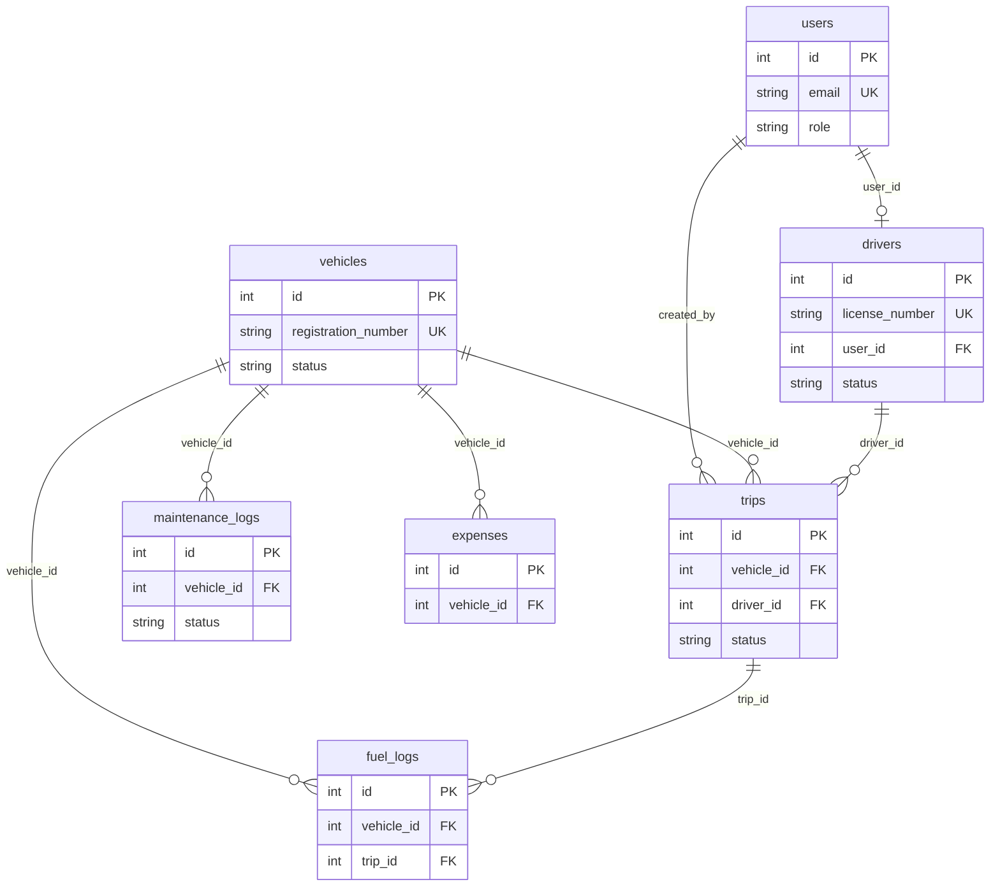

# TransitOps

**Smart Transport Operations Platform**

One place to run a fleet: vehicles, drivers, trip dispatch, maintenance, fuel & expenses, and live KPIs — with business rules enforced in the API, not only in the UI.

**PostgreSQL · FastAPI · React · Docker Compose**

---

## Quick start

**Need:** [Docker Desktop](https://www.docker.com/products/docker-desktop/) (Mac/Windows) or Docker Engine + Compose (Linux). No local Node, Python, or Postgres required.

```bash
git clone https://github.com/sreecharan-desu/odoo-hackathon-2026.git
cd odoo-hackathon-2026
cp .env.example .env                 # Windows CMD: copy .env.example .env
docker compose up --build            # or: docker-compose up --build
```

| | |
|--|--|
| **App** | http://localhost:8080 |
| **API docs** | http://localhost:8080/docs |
| **Login** | `fleet@example.com` / `Password123!` |

The web UI calls `/api` on the same origin (nginx → API), so the app works even if host port `8000` is already taken.

```bash
docker compose down                  # stop
docker compose down -v && docker compose up --build   # wipe DB + reseed
```

Full demo script: [docs/DEMO.md](./docs/DEMO.md)

---

## What it does

| Module | Highlights |
|--------|------------|
| **Auth + RBAC** | Fleet Manager, Driver, Safety Officer, Financial Analyst |
| **Dashboard** | Live KPIs; filter fleet by type, status, region |
| **Fleet** | Unique plates, capacity, odometer, status lifecycle |
| **Drivers** | Licenses, expiry checks, safety scores |
| **Trips** | Draft → Dispatched → Completed / Cancelled; dispatch pool + Available drivers only |
| **Maintenance** | Open job → vehicle **In Shop** (hidden from dispatch) |
| **Fuel & expenses** | Cost logging; per-vehicle operational totals |
| **Analytics** | Fuel efficiency (km/L), vehicle ROI, CSV export — amounts in **₹** |

### Rules enforced by the API

No double-booking · cargo ≤ max load · expired / suspended licenses blocked · In Shop / Retired excluded from dispatch · status updates on dispatch, complete, cancel, and maintenance

---

## Demo accounts

| Role | Email | Password |
|------|-------|----------|
| Fleet Manager | fleet@example.com | Password123! |
| Driver | driver@example.com | Password123! |
| Safety Officer | safety@example.com | Password123! |
| Financial Analyst | finance@example.com | Password123! |

Seed includes demo spine: **VAN-05**, **TRK-12** (In Shop), **VAN-99** (Retired), **Alex**, **Expired Sam**.

---

## Stack

| Layer | Choice |
|-------|--------|
| Database | PostgreSQL 16 + Alembic migrations |
| API | FastAPI + SQLAlchemy + JWT / RBAC |
| Web | React 19 + TypeScript + Vite |
| Run | Docker Compose (db + api + web) |

Owned backend and database — no Firebase / Supabase / Atlas.

More detail: [docs/ARCHITECTURE.md](./docs/ARCHITECTURE.md) · [docs/STACK.md](./docs/STACK.md)

### Data model



---

## Project layout

```
apps/api/   FastAPI — controllers → services → models
apps/web/   React SPA
docker/     Compose helpers
docs/       Architecture, demo, stack
```

---

## Troubleshooting

| Problem | Fix (Mac / Linux) | Fix (Windows PowerShell) |
|---------|-------------------|---------------------------|
| Port `8080` busy | `WEB_PORT=8081 docker compose up --build` | `$env:WEB_PORT=8081; docker compose up --build` |
| Port `8000` busy | App at `:8080` still works; optional `BACKEND_PORT=8001 …` | Same — app does not depend on host `:8000` |
| Port `5433` busy | `POSTGRES_PORT=5434 docker compose up --build` | `$env:POSTGRES_PORT=5434; docker compose up --build` |
| Empty / stale data | `docker compose down -v && docker compose up --build` | Same |

---

## Team

| Member | Focus |
|--------|--------|
| SreeCharan Desu | Backend, database, integration |
| Bhanu Prakash Alahari | Web application |
| Anand Velpuri | Forms, validation, seed |
| Naga Mohan Madicharla | Design system & UI |

See [CONTRIBUTING.md](./CONTRIBUTING.md) for branch and PR workflow.
