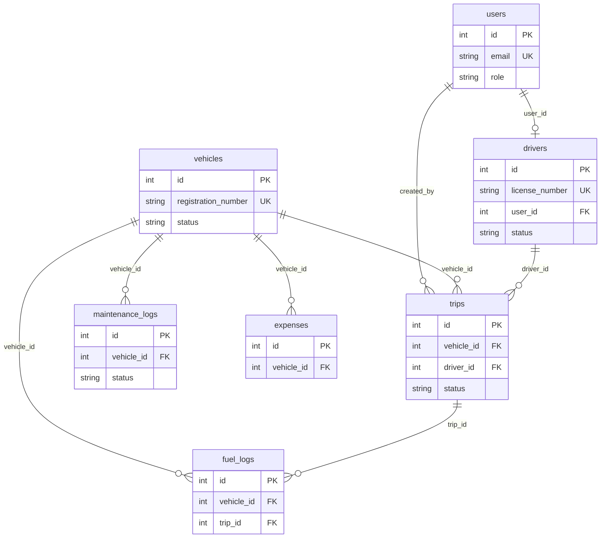

# TransitOps

**Smart Transport Operations Platform** · Odoo Hackathon 2026 (8 hours)

End-to-end transport operations: vehicles, drivers, dispatch, maintenance, fuel & expenses, and analytics — with **business rules enforced in the API** and **role-based access** for four operator desks.

**PostgreSQL · FastAPI · React · Docker Compose**

---

## Quick start

**Need:** [Docker Desktop](https://www.docker.com/products/docker-desktop/) (Mac/Windows) or Docker Engine + Compose (Linux). No local Node, Python, or Postgres required.

```bash
git clone https://github.com/sreecharan-desu/odoo-hackathon-2026.git
cd odoo-hackathon-2026
cp .env.example .env                 # Windows CMD: copy .env.example .env
docker compose up --build            # or: docker-compose up --build
```

| | |
|--|--|
| **App** | http://localhost:8080 |
| **API docs** | http://localhost:8080/docs |
| **Login** | `fleet@example.com` / `Password123!` |

The web UI calls `/api` on the same origin (nginx → API), so the app works even if host port `8000` is already taken.

```bash
docker compose down                  # stop
docker compose down -v && docker compose up --build   # wipe DB + reseed
```

Walkthrough: [docs/DEMO.md](./docs/DEMO.md) · Architecture: [docs/ARCHITECTURE.md](./docs/ARCHITECTURE.md)

---

## Objective

Digitize the full transport operations lifecycle so logistics teams stop relying on spreadsheets and logbooks — reducing scheduling conflicts, missed maintenance, expired licenses, inaccurate expenses, and poor visibility.

---

## Target users (RBAC)

Role is assigned on the **user account after email/password login** (not chosen on the login form). Each role gets a dedicated nav and home.

| Role | Focus | Demo login |
|------|--------|------------|
| **Fleet Manager** | Fleet assets, maintenance, lifecycle, operational efficiency | `fleet@example.com` |
| **Driver** | Create trips, assign vehicle/driver, monitor deliveries | `driver@example.com` |
| **Safety Officer** | Driver compliance, license validity, safety scores | `safety@example.com` |
| **Financial Analyst** | Expenses, fuel, maintenance costs, profitability | `finance@example.com` |

Password for all: `Password123!`

---

## Functional coverage

| § | Area | In this repo |
|---|------|----------------|
| **3.1** | Auth | Email/password + JWT; only authenticated users reach the app |
| **3.2** | Dashboard | Active / Available / In Maintenance vehicles; Active & Pending trips; Drivers on duty; Fleet utilization %; filters by type, status, region |
| **3.3** | Vehicle registry | Unique registration, name/model, type, max load, odometer, acquisition cost, status (`Available`, `On Trip`, `In Shop`, `Retired`) |
| **3.4** | Drivers | Name, license #, category, expiry, contact, safety score, status (`Available`, `On Trip`, `Off Duty`, `Suspended`) |
| **3.5** | Trips | Source, destination, available vehicle & driver, cargo, distance; lifecycle **Draft → Dispatched → Completed / Cancelled** |
| **3.6** | Maintenance | Open log → vehicle **In Shop** (removed from dispatch pool) |
| **3.7** | Fuel & expenses | Liters, cost, date + other expenses; operational cost per vehicle |
| **3.8** | Analytics | Fuel efficiency (distance/fuel), utilization, operational cost, vehicle ROI; **CSV export** (PDF optional / not required) |

Amounts are shown in **₹**.

---

## Mandatory business rules

Enforced in the service layer (not UI-only):

- Vehicle registration number is unique
- **Retired** / **In Shop** vehicles never appear in dispatch selection
- Expired license or **Suspended** drivers cannot be assigned
- Vehicle or driver already **On Trip** cannot take another trip
- Cargo weight ≤ vehicle max load
- **Dispatch** → vehicle & driver become **On Trip**
- **Complete** or **cancel** (dispatched) → both return to **Available**
- Open maintenance → **In Shop**; close → **Available** (unless Retired)

---

## Example workflow (demo spine)

1. Register vehicle **Van-05** (max 500 kg) → Available  
2. Register driver **Alex** with a valid license  
3. Create trip with cargo **450 kg**  
4. System allows dispatch (450 ≤ 500)  
5. Vehicle & driver → **On Trip**  
6. Complete with final odometer + fuel  
7. Both → **Available**  
8. Open maintenance (e.g. Oil Change) → vehicle **In Shop**, hidden from dispatch  
9. Reports refresh operational cost and fuel efficiency  

Seed also includes fail-beats such as **TRK-12** (In Shop), **VAN-99** (Retired), and **Expired Sam**.

---

## Database entities

Users (with role) · Vehicles · Drivers · Trips · Maintenance logs · Fuel logs · Expenses



---

## Deliverables checklist

| Deliverable | Status |
|-------------|--------|
| Responsive web UI | Done |
| Authentication with RBAC | Done |
| CRUD for vehicles & drivers | Done |
| Trip management + validations | Done |
| Automatic status transitions | Done |
| Maintenance workflow | Done |
| Fuel & expense tracking | Done |
| Dashboard with KPIs | Done |

### Bonus (optional)

| Bonus | Notes |
|-------|--------|
| Charts / visual analytics | Partial (cost bars, dashboard visuals) |
| PDF export | Optional — CSV is implemented |
| Email license reminders | Not required for core demo |
| Vehicle document management | Not required for core demo |
| Search, filters, sorting | Partial on list pages |
| Dark mode toggle | App ships with a dark UI |
| Kubernetes / Skaffold | Optional — see note below |

---

## Stack

| Layer | Choice |
|-------|--------|
| Database | PostgreSQL 16 + Alembic |
| API | FastAPI + SQLAlchemy + JWT / RBAC |
| Web | React 19 + TypeScript + Vite |
| Run | Docker Compose (db + api + web) |

Owned backend and database — no Firebase / Supabase / Atlas. See [docs/STACK.md](./docs/STACK.md).

```
apps/api/   FastAPI — controllers → services → models
apps/web/   React SPA (role-scoped nav)
docker/     Compose helpers
docs/       Architecture, demo, stack
k8s/        Optional Kubernetes manifests (future scaling)
skaffold.yaml   Optional Skaffold dev workflow config
```

### ☸️ Kubernetes — Optional Future Enhancement

> **Not required to run the project.** The standard setup is Docker Compose (see Quick start above).

The `k8s/` directory and `skaffold.yaml` were contributed as a **forward-looking, production-scaling path** for when the platform outgrows a single Docker host. They are **not wired into the default development or demo workflow**.

| Manifest | Purpose |
|----------|---------|
| `k8s/postgres-deployment-and-service.yaml` | PostgreSQL pod + ClusterIP service |
| `k8s/database-persistent-volume-claim.yaml` | 2 Gi persistent volume for data durability |
| `k8s/backend-deployment-and-service.yaml` | FastAPI pod + ClusterIP service |
| `k8s/frontend-deployment-and-service.yaml` | React/Nginx pod + NodePort service |
| `k8s/ingress.yaml` | NGINX Ingress — routes `/api` → API, `/` → Web |
| `skaffold.yaml` | Skaffold build & deploy pipeline for local K8s dev |

**When would you actually use this?**
- Horizontal scaling (multiple API replicas behind a load balancer)
- Zero-downtime rolling deploys via `kubectl rollout`
- Managed cloud clusters (GKE, EKS, AKS)
- Environments where Docker Compose is not available

**To try it** (requires a running cluster such as minikube or kind):

```bash
# One-shot apply
kubectl apply -f k8s/

# Or iterative dev with live reload
skaffold dev
```

---

## Troubleshooting

| Problem | Fix (Mac / Linux) | Fix (Windows PowerShell) |
|---------|-------------------|---------------------------|
| Port `8080` busy | `WEB_PORT=8081 docker compose up --build` | `$env:WEB_PORT=8081; docker compose up --build` |
| Port `8000` busy | App at `:8080` still works; optional `BACKEND_PORT=8001 …` | Same — app does not depend on host `:8000` |
| Port `5433` busy | `POSTGRES_PORT=5434 docker compose up --build` | `$env:POSTGRES_PORT=5434; docker compose up --build` |
| Empty / stale data | `docker compose down -v && docker compose up --build` | Same |

---

## Team

| Member | Focus |
|--------|--------|
| SreeCharan Desu | Backend, database, integration |
| Bhanu Prakash Alahari | Web application |
| Anand Velpuri | Forms, validation, seed |
| Naga Mohan Madicharla | Design system & UI |

Branch / PR workflow: [CONTRIBUTING.md](./CONTRIBUTING.md)
